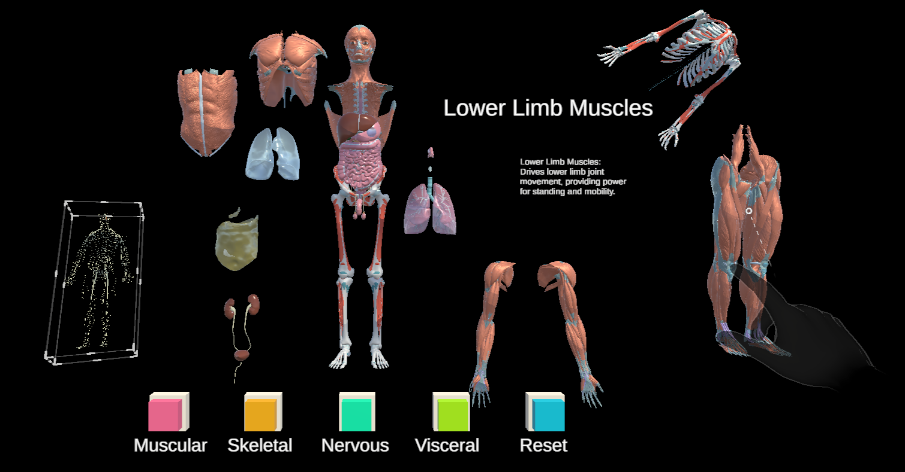
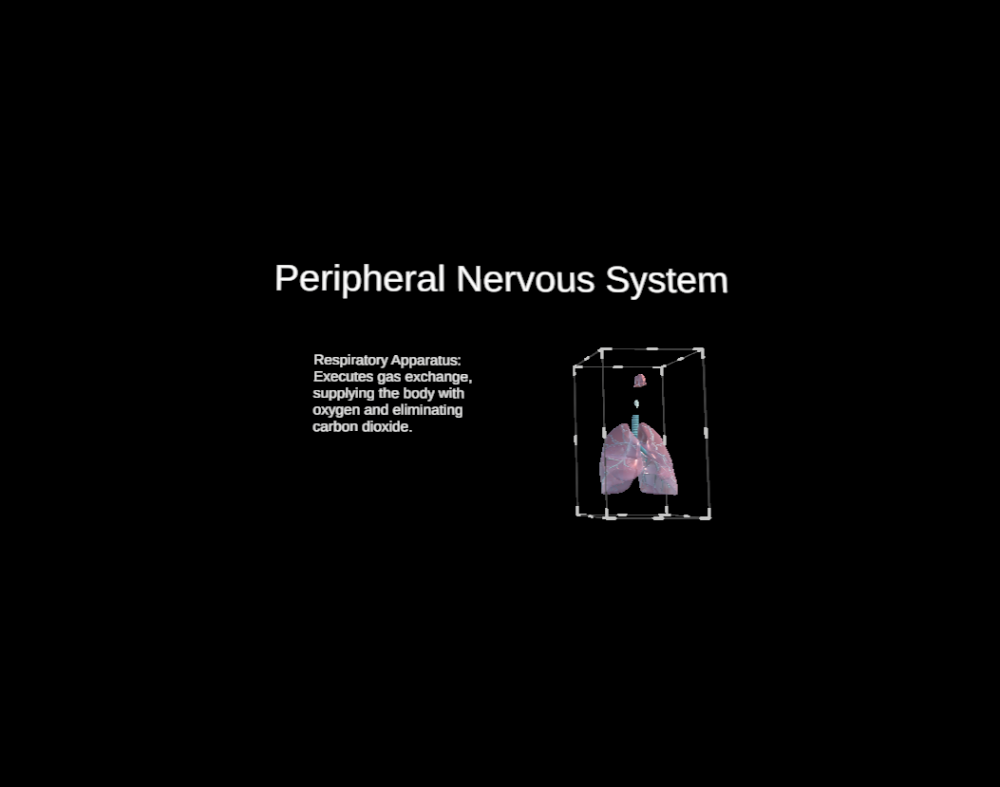
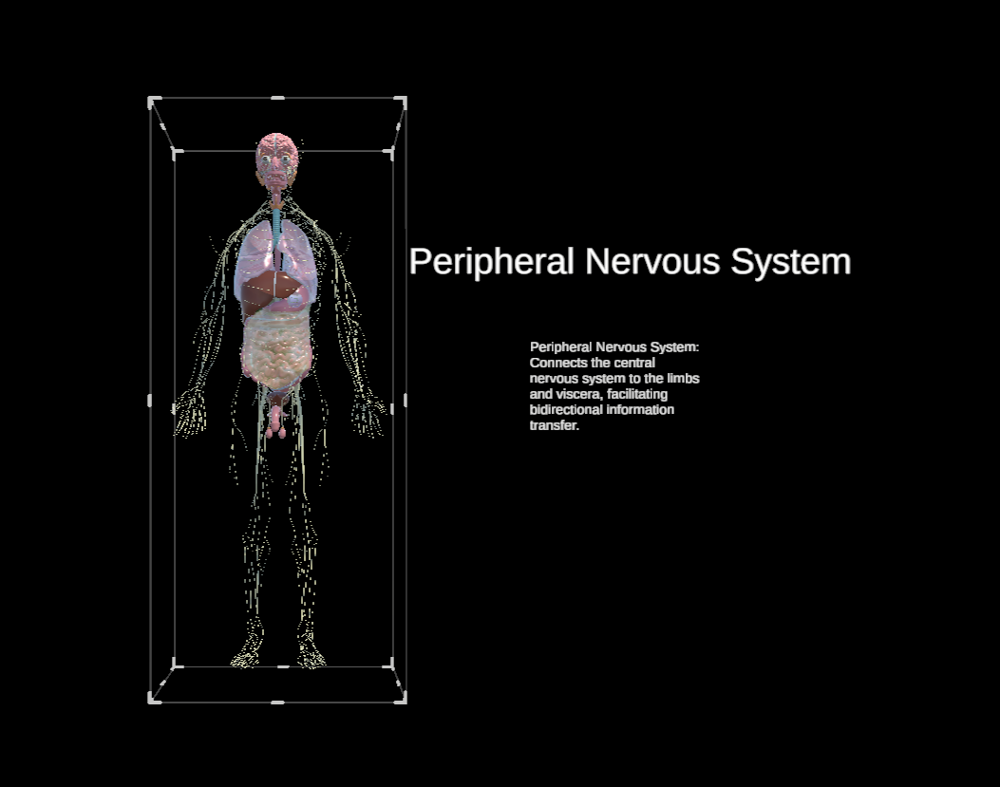
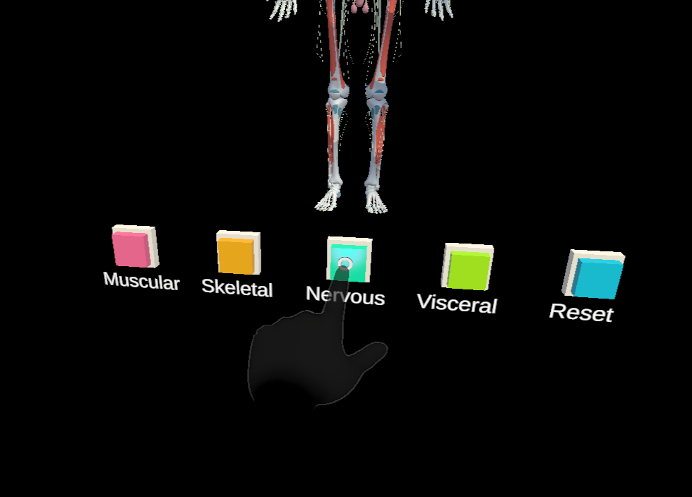
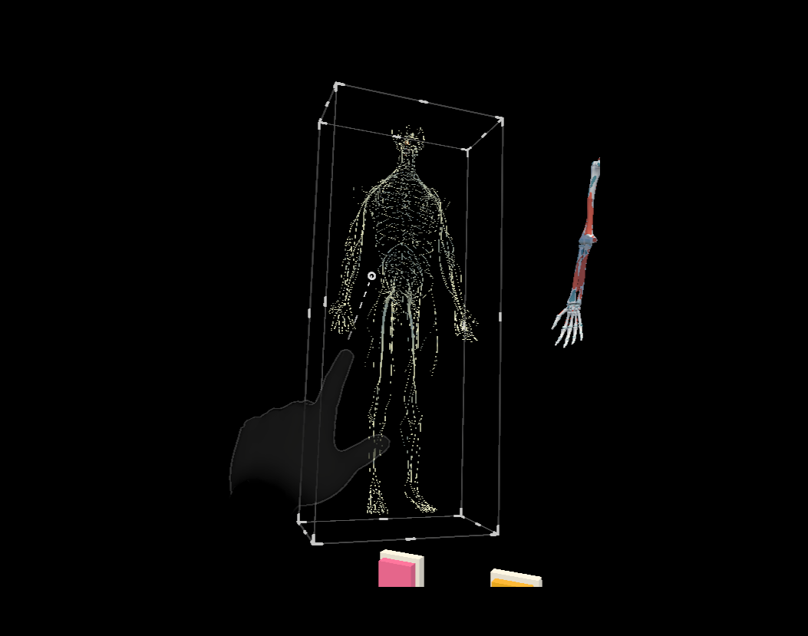
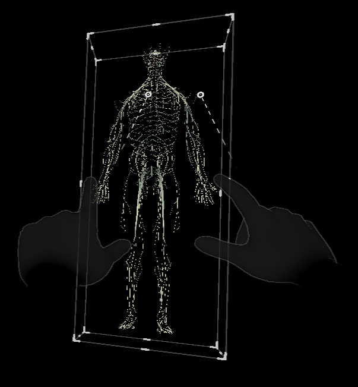
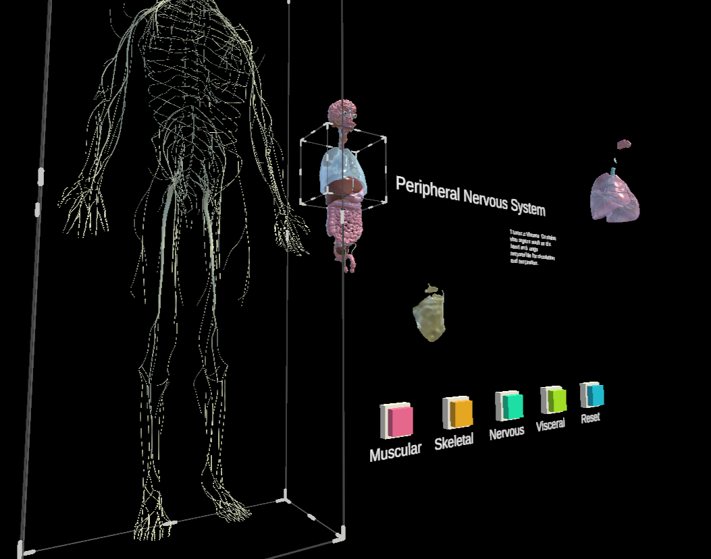

# IMVA


IMVA is an interactive mixed reality anatomy learning project built with Unity and MRTK3 for immersive education and training scenarios.



## Visual Showcase

### Information Display



### Interaction Controls




### Spatial Exploration


These screenshots demonstrate key workflows: anatomy name/description display, system isolation by hiding unrelated parts, near-interaction layer toggles with fingertip highlight feedback, far-pinch manipulation for translation/rotation/scale, and free spatial inspection from multiple VR viewing angles.

# Background and Features

## Why this project

Traditional anatomy learning often lacks spatial depth and interaction. This project explores a mixed reality workflow where users can inspect, select, and manipulate anatomy content in 3D space with natural input.

## Core features

- Mixed reality anatomy exploration with MRTK3 interaction patterns.
- Selection, clipping, and cross-section related interaction workflows.
- Custom UI and editor tooling for scene and workflow iteration.
- Multi-platform deployment path (HoloLens / Android XR pipelines).

# Quick Start

This section is designed so you can open and run the project with minimal setup.

## Requirements

- Windows/macOS with Unity Hub installed
- **Unity 2021.3.45f2 LTS**
- Optional modules (recommended):
  - Universal Windows Platform Build Support (HoloLens 2)
  - Android Build Support (Quest / Android XR)

## Installation

1. Clone the repository:

```bash
git clone https://github.com/auroey/mr-IMVA-unity.git
```

2. Open **Unity Hub** -> **Add** -> select:

```text
UnityProjects/MRTKDevTemplate
```

3. Open the scene:

```text
Assets/Scenes/EmptyScene/my.unity
```

4. Press Play in Unity Editor.

# Usage

## Common workflows

- **Open project**: `UnityProjects/MRTKDevTemplate`
- **Main scene entry**: `Assets/Scenes/EmptyScene/my.unity`
- **Custom runtime logic**: `Assets/Scripts/`
- **Editor tooling**: `Assets/Editor/`

## Configuration

- Unity packages are managed in `UnityProjects/MRTKDevTemplate/Packages/manifest.json`.
- Project-wide settings live under `UnityProjects/MRTKDevTemplate/ProjectSettings/`.
- For reproducible environments, keep Unity version pinned to `2021.3.45f2`.

## Online dependencies

On first open, Unity will resolve external packages from Unity Registry and GitHub, so network access is required. Important dependencies include:

- `com.microsoft.mixedreality.openxr` (1.11.2)
- `com.microsoft.mixedreality.visualprofiler` (GitHub v2.2.0)
- `com.microsoft.mrtk.graphicstools.unity` (0.8.0)
- `com.microsoft.mrtk.tts.windows` (1.0.4)
- `com.microsoft.spatialaudio.spatializer.unity` (2.0.55)
- `com.unity.*` packages (URP, Input System, TextMeshPro, etc.)

# Architecture and Tech Stack

## Key repository structure

```text
.
├── UnityProjects/
│   └── MRTKDevTemplate/               # Unity project root
│       ├── Assets/
│       │   ├── Scripts/               # Runtime/game logic
│       │   ├── Editor/                # Editor tools
│       │   ├── Scenes/                # Scene assets
│       │   └── Models/                # Anatomy and other 3D assets
│       ├── Packages/manifest.json     # Unity package dependencies
│       └── ProjectSettings/           # Unity project settings
├── org.mixedrealitytoolkit.*          # MRTK3 local source packages
├── Pipelines/                         # CI/CD related configs
├── Tooling/                           # Utility scripts and tools
└── docs/                              # Documentation
```

## Tech stack

| Component | Version |
|---|---|
| Unity | 2021.3.45f2 LTS |
| Render Pipeline | URP 12.1.15 |
| XR Framework | OpenXR 1.13.0 + XR Interaction Toolkit 2.6.3 |
| MR Platform | Microsoft Mixed Reality OpenXR 1.11.2 |
| AR | AR Foundation + ARCore 5.0.5 |
| Hand Tracking | Unity XR Hands 1.3.0 |
| Input System | Unity Input System 1.7.0 |
| MRTK | Mixed Reality Toolkit 3 (v3.3.0 – v3.4.0 dev) |
| Graphics Tools | MRTK Graphics Tools 0.8.0 |
| Spatial Audio | Microsoft Spatial Audio 2.0.55 |
| 3D Import | glTFast 6.10.1 |
| Text | TextMeshPro 3.0.6 |
| JSON | Newtonsoft JSON + FullSerializer |
| Outline | UnityFx.Outline (Core + URP) |

## MRTK3 module dependency sketch

```text
core -> input -> spatialmanipulation -> uxcore -> uxcomponents
   |                                   \-> uxcomponents.noncanvas
   +-> audio
   +-> diagnostics
   +-> data (optional)
   +-> accessibility
   +-> windowsspeech
   \-> tools

standardassets -> extendedassets
```

# FAQ / Troubleshooting

## Package resolution failed on first open

- Confirm internet connectivity and proxy settings.
- Re-open Unity Hub and relaunch the project to retry package restore.
- Verify access to GitHub and Unity package registry endpoints.

## Scene cannot be opened or references are missing

- Ensure project root is `UnityProjects/MRTKDevTemplate` (not repository root).
- Confirm Unity version is exactly `2021.3.45f2`.
- Let Unity finish initial package import before opening scenes.

## Build target issues (HoloLens / Android XR)

- Install required Unity modules for the target platform in Unity Hub.
- Check XR/OpenXR package versions and target platform settings in Project Settings.

# Contributing / Development

Contributions are welcome. For smooth collaboration:

1. Fork and create a feature branch:

```bash
git checkout -b feature/your-feature-name
```

2. Keep changes focused and test in Unity Editor before opening a PR.
3. Write clear commit messages (recommended: Conventional Commits).
4. Open a Pull Request with:
   - what changed
   - why it changed
   - how it was tested

# License and Acknowledgements

- This project includes MRTK3-related components and is distributed under the [BSD 3-Clause License](./LICENSE.md).
- Thanks to the Unity and MRTK ecosystem maintainers and contributors.
- This project is the code repository for my undergraduate graduation thesis, and it is the engineering work most aligned with my interests during my undergraduate years. I would like to place a closing passage from my thesis here.


> As the thesis is finalized, outside the window in Dundee, there remain the orange sunset, the lush green grass, and the eaves with resting pigeons. I unavoidably fall into the familiar pattern of feeling a multitude of emotions; there are too many thanks worthy of me solemnly writing into the front pages of this thesis.  
> 论文定稿之际，邓迪的窗外依旧是昏黄的落日、葱绿的草地与鸽群驻留的屋檐。我不免落俗地感慨万千，有太多感谢值得我郑重地写在正文之前。

> First, I sincerely thank my supervisor, Dr. Cheng Wei. To me, he is not only a supervisor who gave me rigorous guidance in academics and helped me clarify my research ideas, but also a benevolent elder, who always gave me patient direction and selfless help.  
> 首先，衷心感谢我的导师，Dr. Cheng Wei。于我而言，他不仅在学术上给予我严谨指导、帮我理清研究思路，更是一位仁厚的长辈、给予我耐心的指引与无私的帮助。

> I thank my family and friends, who gave me their company and unreserved support when I was lonely; I thank every building during my university time, every wildly growing tree, and every gust of wind that blew past me; I thank fate for its kindness, and myself who never felt hopeless.  
> 感谢亲人与挚友，在我落寞时给予我陪伴与毫无保留的支持；感谢大学时光里的每一栋建筑，每一棵肆意生长的树，以及每一阵吹拂过我的风；感谢命运的温柔以待，也感谢那个未曾放弃的自己。

> Hereafter, I will carry this goodwill and continue to move forward, walking from one moon to another.  
> 此后我便要怀着这些善意继续前行，从一个月亮走向另一个月亮。

> May all that we do yield gains, and may all farewells lead to reunions.  
> 愿我们的所作皆有所得，愿所有的道别都走向重逢。
